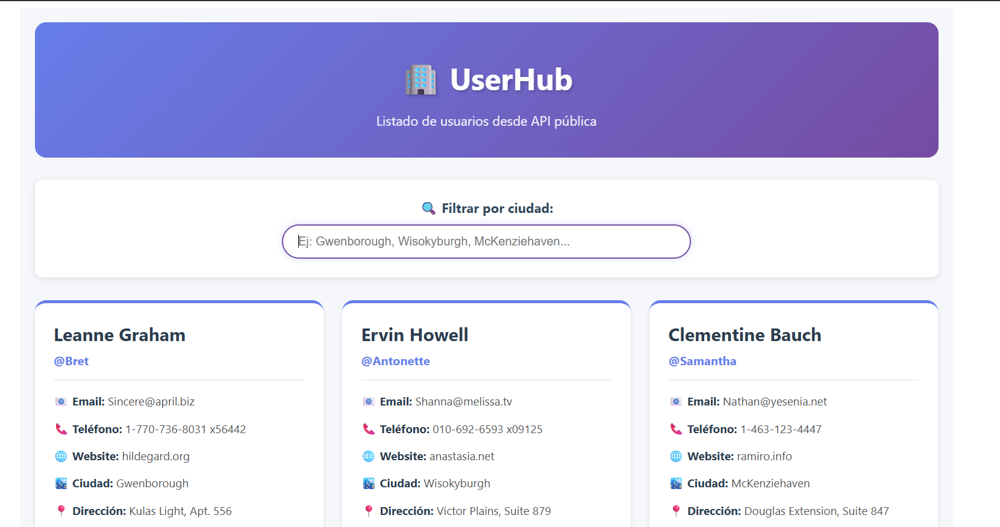
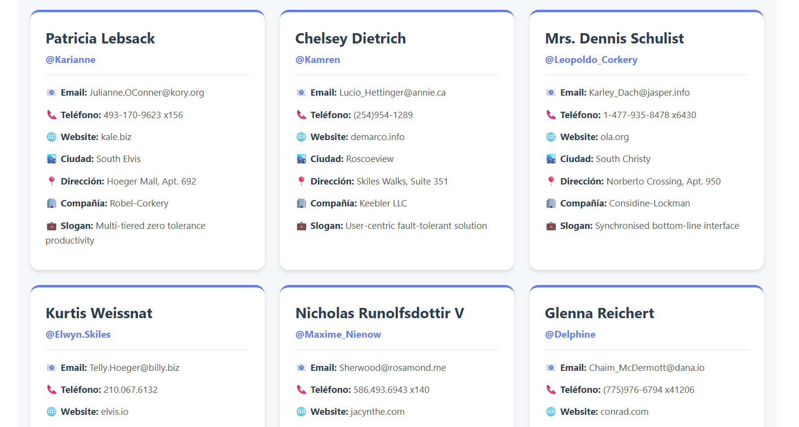
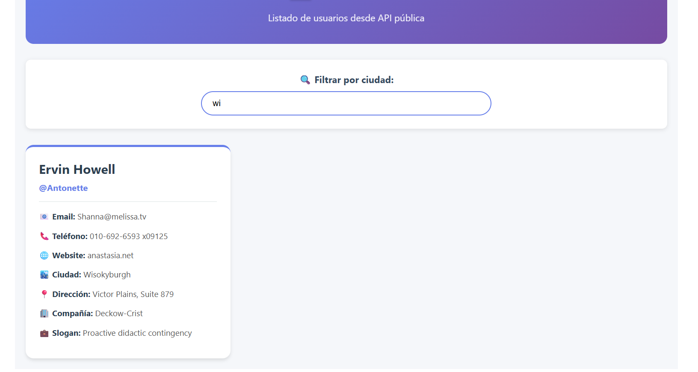
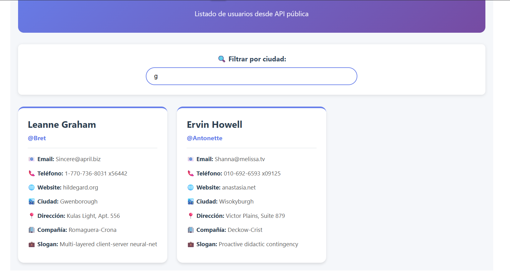
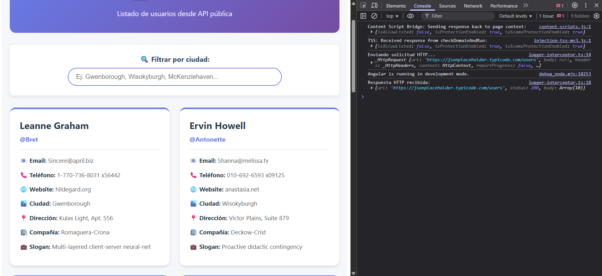
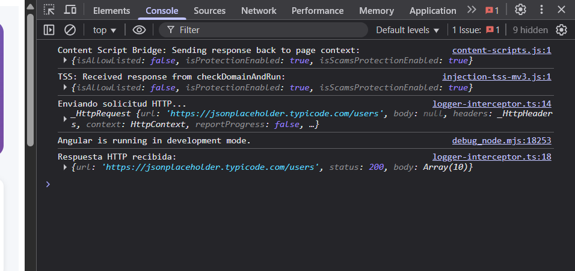

# UserHub - Aplicación Angular con Interceptores y Pipes

## 📋 Descripción del Proyecto

UserHub es una aplicación Angular con **NgModules** que lista usuarios obtenidos desde la API pública de JSONPlaceholder. La aplicación demuestra el uso de interceptores HTTP basados en clases y pipes personalizados para transformar y filtrar datos.

## 🚀 Características

- **Interceptor HTTP personalizado** basado en clase que implementa HttpInterceptor
- **Pipes personalizados** declarados en AppModule para capitalización y filtrado
- **Diseño responsive** con tarjetas de usuario estilizadas
- **Búsqueda en tiempo real** por ciudad con filtrado dinámico

## 🛠️ Tecnologías

- Angular 17+ (NgModules)
- TypeScript
- RxJS
- HttpClient
- FormsModule
- JSONPlaceholder API

## 📦 Instalación
npm install
ng serve

Abre http://localhost:4200 en tu navegador.

## 🔧 Funcionamiento del Interceptor

El interceptor `HttpLoggerInterceptor` es una **clase que implementa HttpInterceptor** y cumple las siguientes funciones:

1. **Header personalizado**: Agrega `X-App-Name: UserHub` a todas las peticiones HTTP mediante `req.clone()`
2. **Logging de solicitudes**: Muestra "⏳ Enviando solicitud HTTP..." antes de cada petición
3. **Logging de respuestas**: Detecta `HttpResponse` y muestra "✅ Respuesta recibida" con detalles
4. **Manejo de errores**: Usa `catchError` para capturar errores 404 y 500, mostrando mensajes específicos en consola

### Registro del Interceptor

El interceptor se registra en el `AppModule` usando el token `HTTP_INTERCEPTORS`:

providers: [
{
provide: HTTP_INTERCEPTORS,
useClass: HttpLoggerInterceptor,
multi: true // Permite múltiples interceptores
}
]

## 🎯 Pipes Personalizados

### 1. capitalizeName
- **Función**: Capitaliza la primera letra de cada palabra en un nombre
- **Ejemplo**: `"leanne graham"` → `"Leanne Graham"`
- **Uso en template**: `{{ user.name | capitalizeName }}`
- **Declaración**: Pipe registrado en el array `declarations` de AppModule

### 2. filterByCity
- **Función**: Filtra la lista de usuarios por ciudad (case-insensitive)
- **Tipo**: Impure pipe (`pure: false`) para detectar cambios en tiempo real
- **Uso en template**: `*ngFor="let user of users | filterByCity:cityFilter"`
- **Declaración**: Pipe registrado en el array `declarations` de AppModule

### Declaración de Pipes

Ambos pipes se declaran en `AppModule`:

declarations: [
AppComponent,
CapitalizeNamePipe,
FilterByCityPipe
]

## 📸 Capturas de Pantalla

### Vista Principal

### Filtro por Ciudad

### Consola del Navegador

## 🎓 Conceptos Aprendidos

- Implementación de interceptores HTTP basados en clases
- Creación de pipes personalizados con transformaciones
- Registro de providers con `multi: true`
- Integración de HttpClient en NgModules
- Manejo de errores HTTP con RxJS operators

## 👨‍💻 Autor

Carlos Mario Arroyave Martínez- 
Desarrollado como taller práctico de Angular.

## Ejecutar la aplicación 

ng serve
